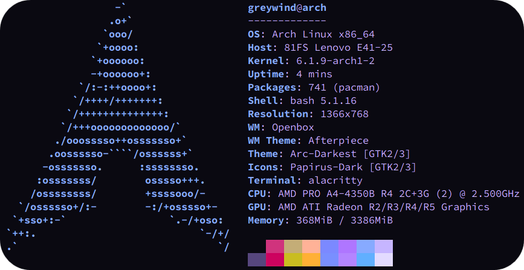

  

<h1 align="center">Hi there, I'm Sajith S 👋</h1>
<h3 align="center">AI Engineer | Computer Vision & NLP Specialist | Building Intelligent End-to-End Systems</h3>

  
  
  

---

  I'm an AI Engineer from India with a passion for transforming complex problems into intelligent, scalable, and automated solutions. My expertise lies at the intersection of <strong>Computer Vision (CV)</strong>, <strong>Natural Language Processing (NLP)</strong>, and <strong>Generative AI</strong>. I specialize in developing end-to-end AI applications, from data processing and model fine-tuning to MLOps deployment and building robust backend systems.

---

## 🚀 My Featured Projects

<table>
  <tr>
    <td width="50%">
      <h3 align="center">Learning Journal</h3>
      

        

          A personal repository documenting my learning journey across programming, AI, and technology.
        

        

          
        

        
      

    </td>
    <td width="50%">
      <h3 align="center">Agentic TTS Crew: Autonomous Research to Speech Synthesis</h3>
      

        

        A multi-agent system built with CrewAI that autonomously researches a given topic, generates a concise summary, and converts it into high-quality speech—coordinated by a manager agent orchestrating specialized agents to showcase agentic workflows in action.
        

        

          
          
          
          
          
        

        
      

    </td>
  </tr>
  <tr>
    <td width="50%">
      <h3 align="center">Gesture-Based Tool for Sterile Browsing</h3>
      

        

          A real-time, gesture-controlled interface allowing surgeons to browse radiology images (X-rays, CT scans) in the operating room without physical contact, ensuring sterility.
        

        

          
          
          
        

        
      

    </td>
    <td width="50%">
      <h3 align="center">IELTS Writing Task 2 Validator</h3>
      

        

          An automated validation tool that provides detailed feedback on IELTS Writing Task 2 responses, leveraging Amazon Bedrock and custom-trained language models for analysis.
        

        

          
          
          
          
        

        
      

    </td>
  </tr>
  <tr>
    <td width="50%">
      <h3 align="center">Vege Buy - Smart Billing Machine</h3>
      

        

          A intelligent system that automates vegetable identification, weighing, and billing using computer vision on a Raspberry Pi, creating a seamless checkout experience.
        

        

          
          
          
          
        

        
      

    </td>
    <td width="50%">
      <h3 align="center">LIDAR-Enabled Smart Cane</h3>
      

        

          Contributed to a smart cane that integrates LIDAR and a Raspberry Pi for real-time obstacle detection and autonomous navigation, assisting visually impaired users. My role focused on processing LIDAR signals to control wheel movement.
        

        

          
          
          
          
        

        
      

    </td>
  </tr>
  <tr>
    <td width="50%">
      <h3 align="center">AI-Powered Math Problem Solver</h3>
      

        

          An efficient AI-powered application that solves complex math problems directly from screenshots. It leverages a multi-LLM "self-correction" pipeline to ensure high accuracy and provides detailed, step-by-step solutions.
        

        

          
          
          
          
          
          
          
        

        
      

    </td>
    <td width="50%">
      <h3 align="center">Image Classification with CNN</h3>
      

        

          This project demonstrates how to build a Convolutional Neural Network (CNN) using TensorFlow/Keras to classify images of vegetables. The workflow covers data preparation, augmentation, model building, training, evaluation, and tuning.
        

        

          
          
          
          
        

        
      

    </td>
  </tr>
</table>

---

## 🛠️ My Tech Stack & Toolbox

### 🚩 Primary Skills

  
  
  
  
  
  
  
  
  

### 🤖 Generative AI / Agentic AI / Prompt Engineering

  
  
  
  
  
  
  
  

### 📊 Machine Learning / Deep Learning / Computer Vision / NLP

  
  
  
  
  
  
  
  
  
  

### ⚙️ MLOps / LLMOps

  
  
  
  
  
  
  
  
  
  
  
  

### ☁️ Cloud Services

  
  
  

### 🖥️ Backend

  
  
  
  
  

### 💻 Programming Languages

  
  
  
  
  
  
  

---

## 💼 Professional Experience

### **Associate Software Engineer** @ [CapeStart Software Private Ltd](https://www.capestart.com/)

_(Sep 2023 - Present)_

- Architected and deployed end-to-end AI applications, integrating deep learning and traditional ML.
- Specialized in Computer Vision tasks including object detection and image segmentation.
- Fine-tuned and hosted Large Language Models (LLMs) and developed advanced document processing pipelines using NLP, RAG, and vector embeddings for medical and legal documents.
- Streamlined operations by developing AI agents and managing CI/CD, MLOps, and DBMS workflows.

### **Machine Learning Intern** @ [CapeStart Software Private Ltd](https://www.capestart.com/)

_(Feb 2023 - Sep 2023)_

- Executed data extraction, summarization, and table extraction from medical literature for pharmaceutical research.
- Developed custom OCR models to process text and symbols in medical documents.
- Designed Object Detection models to identify and categorize sections within large PDFs.

---
